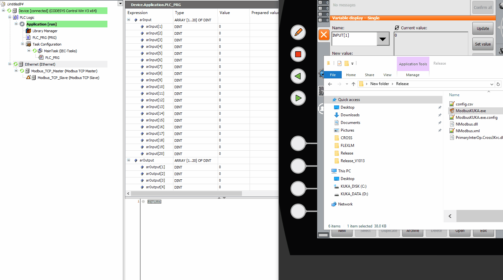

# ModbusKUKA
A Modbus TCP Slave for KRC4 Controller

## WHY

KUKA not provide modbus TCP protocol, kukavarproxy only support 1 var request, it very slow. C3bridge support multi variables, But it not easy trans to different PLC's.

They all based on CROSS3 protocol, its a private protocol in kuka system. There have no documents. Luckly, they have dll file(PrimaryInterOp.Cross3Krc.dll) and we can use it.

## Performance

Cross3 lib communication with cross3 service use shared memory. Then cross3 trans it to "ADS" communication. But we don't have ADS API and no document here. So we just use Cross3 LIB.

A variable visit will cost about 2ms in cross3. You can monitor it in  Cross3LogViewer.

In this test we get 25 int32 variable result:

|NAME|TIME|NOTE|
|----|----|----|
|kukavarproxy|~90ms|
|c3bridge|~90ms|
|modbusKUKA|~100ms|
|kukavarproxy + TCP|~100ms|
|c3bridge + TCP|~100ms|
|----|----|----|
|kukavarproxy + PLC|~500ms|
|c3bridge + PLC|~500ms|
|modbuskuka + PLC|~100ms|
|modbuskuka + array read| ~50ms|

c3b with plc was slow that because PLC program need wait cycle to visit next variables.

## Use

Modify config.csv as you need. Currently we only support type INT32 and FLOAT32, PLC only use DINT type, Float will use 100.0 multiplier. The input(KUKA -> PLC) support array like `INPUT[],INT[10],0,R`, but output(PLC -> KUKA) not support it. The read process time will large than output, So you can use array to reduce read process time.

You should defined variables in $config.dat.

Sometimes maybe you want visit string or struct, you can also use c3bridge at same time.
